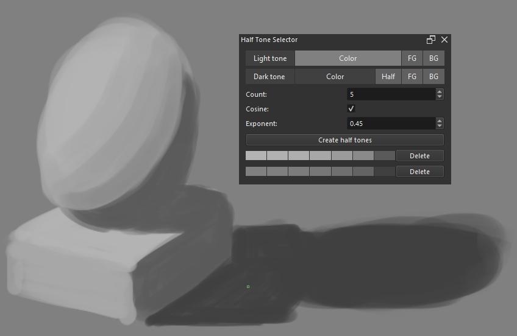

# Half Tone Selector

This plugin generates half tones from user defined light and dark tones. It is useful for shading and practice. If you know the angle between the light rays and what you are drawing, you will know which tone to use. By default, 5 half tones are generated at 15, 30, 45, 60, and 75 degrees. The light and dark tones correspond to 0 and 90 degrees.

## Usage

1. Select the light and dark tones. Clicking on the color brings up the color dialog. "FG" and "BG" copy the foreground and background colors respectively. "Half" computes the tone halfway between the light tone and black.
2. "Count" is the number of half tones between the light and dark tones.
3. "Cosine" and "Exponent" control which tones are chosen. A linear set of tones can be achieved by toggling off "Cosine" and setting "Exponent" to 1.
4. The button "Create" generates a set of tones below the button. Multiple sets of tones can be generated. A set of tones can be cleared by clicking on the delete button. Clicking on a tone updates the foreground color to that tone.

## Install

Please follow Krita's official docs for [installing a custom plugin](https://docs.krita.org/en/user_manual/python_scripting/install_custom_python_plugin.html).

## Example

## References

Plugin development:

* https://scripting.krita.org/lessons/plugins-create
* https://api.kde.org/krita/html/index.html
* https://doc.qt.io/qt-6/widget-classes.html
* https://www.riverbankcomputing.com/static/Docs/PyQt6/index.html
* https://invent.kde.org/graphics/krita/-/blob/master/plugins/python/plugin_importer/plugin_importer.py

Plugins:

* https://github.com/kaichi1342/PaletteGenerator
* https://github.com/KnowZero/Krita-PythonPluginDeveloperTools/tree/main
* https://github.com/EyeOdin/Pigment.O

Color spaces:

* https://developer.chrome.com/docs/css-ui/high-definition-css-color-guide
* https://bottosson.github.io/posts/oklab/
* https://cie.co.at/data-tables
* https://stackoverflow.com/questions/3407942/rgb-values-of-visible-spectrum
* https://jcgt.org/published/0002/02/01/
* https://oklch.com
